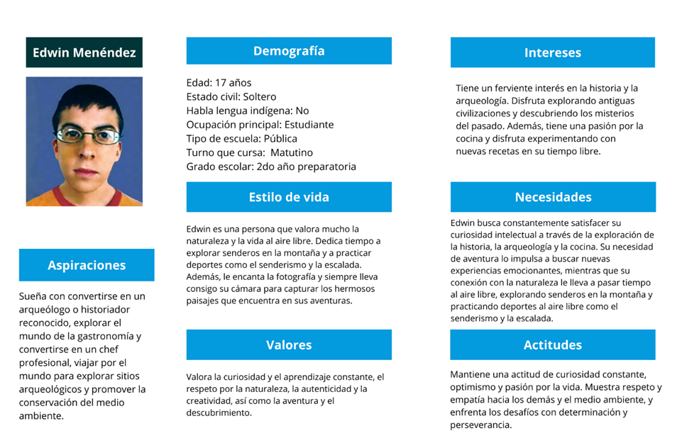
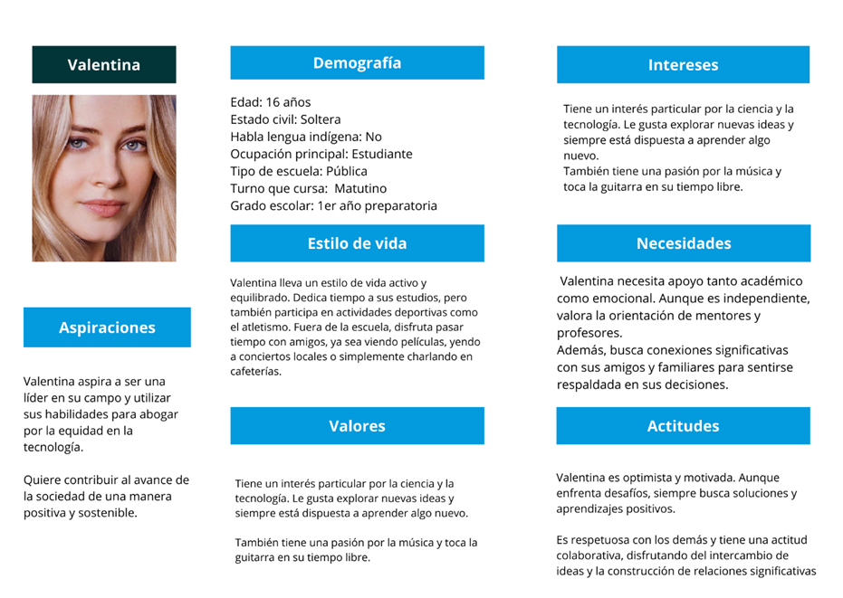

# Perfiles, Personas, Escenarios
## Perfiles

1. Perfil 1: Personas que tomaron clases de educación sexual, pero consideran que no fue suficiente.
2. Perfil 2: Personas que tomaron clases de educación sexual, pero consideran que fue suficiente.
3. Perfil 3: Personas que no tomaron clases de educación sexual, pero consideran que no fue suficiente.
4. Perfil 4: Personas que tomaron no clases de educación sexual, pero consideran que fue suficiente.

## Personas

## Escenarios

### Escenario Edwin Menéndez
Caso de uso: Consultar información sobre un tema específico.
Escenario: Edwin Menéndez, un joven de 17 años que cursa la preparatoria, 
siente que las clases de educación sexual que tomó fueron insuficientes. 
Buscando más información, descubre una aplicación móvil dedicada a temas de salud sexual y reproductiva.
Decide explorarla y encuentra una sección sobre métodos anticonceptivos, un tema que le gustaría comprender mejor.
A través de la aplicación, Edwin accede a información detallada sobre diferentes métodos anticonceptivos, incluyendo 
cómo funcionan, su eficacia y consideraciones importantes. Después de algunas semanas utilizando la aplicación, 
se siente más informado y capacitado para tomar decisiones saludables en relación con su salud sexual y reproductiva.

### Escenario Valentina
Caso de uso: Utilizar la aplicación para consultar con un experto en educación sexual.
Escenario: Valentina tuvo relaciones sexuales con su pareja, pero se pregunta si es necesario 
tomar una pastilla del día siguiente, si bien la conoce, no está consciente de las consecuencias que esto podría traer, 
por lo que decide entrar a la aplicación y preguntar directamente a uno de los expertos en la materia.

